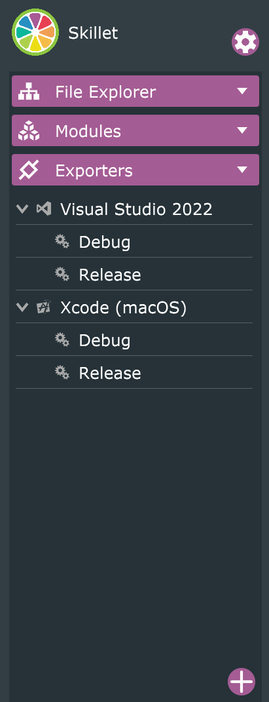

# Skillet
Skillet is a VST3 audio plugin intended to be used in your Digital Audio Workstation (DAW) of choice. This plugin uses psychoacoustics to allow the user to "pan" vertically, i.e. move the sound above or below them. In order to achieve this effect, there are 3 components: a pinna filter, a floor bounce, and a chest bounce.
1) The pinna filter is an EQ that either cuts or boosts high frequencies from about 8kHz to 10kHz based on whether or not the sound is above or below in order to model some of the resonances in our ears.
2) The floor bounce is just a delay which decreases in the amount of time as the sound gets closer to the floor. In addition, higher sounds are quieter since the sound has to travel further till it reaches the ears.
3) The chest bounce is also a delay, but includes a bandpass from about 1kHz to 3kHz to model how the chest absorbs the sound. This is a very subtle effect, but adds a lot to the believability.

The method used in this plugin for vertical "panning" is described in more detail in this video https://www.youtube.com/watch?v=iLZBxa3jQe8&list=WL&index=20&t=1303s

## Build Instructions
1) Open Skillet.jucer in Projucer. Download Projucer at https://juce.com/get-juce/
2) Select exporter at the top (Visual Studio for Windows, Xcode for Mac). This plugin has only been tested on Windows.
    

    More export targets can be added in the "Exporters" panel with the "+" button.
    

3) Build the project in your IDE!

## Installation Instructions
1) VST3 output will be in the Builds folder. (Builds\VisualStudio2022\x64\Debug\VST3 for Visual Studio).
2) Drag Skillet.dll or Skillet.vst3 into your Steinberg VST3 folder and open up your DAW.